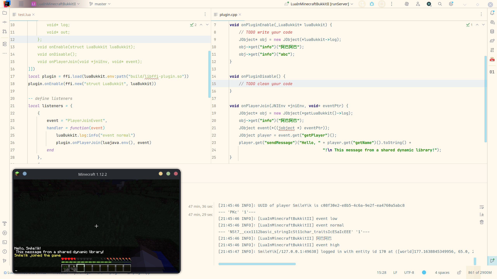

<p align="center">
    
</p>

<p align="center">
    <h1 align="center">LuaInMinecraftBukkit II</h1>
    <p align="center">
        English | <a href="./docs/README.zh.md">中文</a>
    </p>
</p>

<p align="center">
    
    
    
    
    <a href="https://github.com/SmileYik/LuaInMinecraftBukkitII/blob/gh-page/docs/QuickStart.md">
        
    </a>
</p>

[luajava-jasonsantos]: https://github.com/jasonsantos/luajava
[luajava-smileyik]: https://github.com/SmileYik/luajava
[lua-pool-example]: https://github.com/SmileYik/LuaInMinecraftBukkitII/blob/gh-page/docs/en/GlobalVariable.md#pooledcallable---transform-a-lua-closure-into-a-closure-that-can-be-run-in-the-lua-pool
[jni-bridge]: ./modules/jni-bridge

## Introduction

LuaInMinecraftBukkit II is a Minecraft Bukkit server plugin that aims to use Lua scripts 
to interact with Bukkit servers.

Lua is a small scripting language with very simple syntax and decent execution speed. 
Just imagine how wonderful it would be to write a Bukkit plugin with a lightweight script 
that doesn't need to be compiled to run. If you need to modify something, you can just 
change it and reload the script—it's like a dream.

## Differences from the Previous Generation

Compared to the previous generation, this version focuses more on the native Lua virtual machine. 
Similarly, this version is also based on the [luajava][luajava-jasonsantos] project. 
However, this version uses a [cloned luajava][luajava-smileyik] repository. 
Compared to the original repository, the cloned luajava repository has fundamentally rewritten 
parts of the reflection functionality, further simplifying the process of Lua calling Java methods,
and provides very friendly exception messages on the C language side.

## What Can It Do?

Major functions:

+ **Command Registration**: Register any command you want, and it will automatically generate help information and command hierarchy.
+ **Event Listening**: Listen for any Bukkit event you want, even if it's a custom event from another plugin.
+ **Lua Pooling**: By pooling Lua, you can submit Lua closures to run on other state machines to achieve true multi-threaded parallel execution: [Example][lua-pool-example].

Other features include:

+ Fast Reflection: The reflection component for Lua now uses MethodHandle-based fast reflection, which is significantly faster than standard reflection.
+ Auto-Reload: The plugin can monitor changes to Lua script files and automatically reload them.

However, relying on Java's reflection and dynamic proxy mechanisms, it is currently possible to inherit Java interfaces and call any public method or public attribute of a Java type in a Lua script. This means this plugin can dynamically load scripts and enjoy a subset of Java's functionality. Of course, reflection isn't a silver bullet, and there will still be many situations that cannot be handled on the Lua side. In such cases, Java needs to bridge the gap for Lua. But in the development process, I will try to simplify the interaction between Lua and Java.

In addition to what has been mentioned, similar to the first generation, it can also load dynamic link libraries written in C/C++. Of course, these are features that the Lua language itself supports.

## Lua Pooling

Thanks to the tireless efforts of [luajava][luajava-smileyik], 
it is now possible to execute different Lua code on multiple threads. 

In this plugin, each Lua environment configuration has a **main Lua virtual machine**.

Without a pooled Lua virtual machine, when the **main Lua virtual machine** is running, 
if another thread B needs to acquire the execution rights of the **main Lua virtual machine** 
(e.g., when a Bukkit event is triggered or for a Bukkit asynchronous task) to run Lua code 
(such as a Lua closure function), thread B must **block and wait for the main Lua virtual machine**. 
Only after the **main Lua virtual machine** completes its current task can thread B acquire 
the execution rights to run the Lua code. After the Lua code finishes, it must release 
the execution rights of the **main Lua virtual machine**. If the code executed by thread B 
takes a very long time, the **main Lua virtual machine** will remain occupied by thread B, 
blocking the execution of other Lua code until thread B releases the execution rights.

With a Lua pool, in the same scenario, after thread B acquires the execution rights of 
the **main Lua virtual machine**, it will immediately transfer the Lua code to be executed 
and all related data to **another Lua virtual machine**. Once the transfer is complete, 
it will immediately release the execution rights of the **main Lua virtual machine** 
and acquire the execution rights of the **other Lua virtual machine** to run the transferred code. 
This allows thread B to release the execution rights of the **main Lua virtual machine** in 
a very short amount of time, without waiting for the Lua code to finish, ensuring that the 
**main Lua virtual machine** can respond quickly to other calls.

Here is a more specific example. The following code calls two Bukkit asynchronous tasks, and both tasks are infinite loops.

```lua
local import = require "import"
local Thread = import "java.lang.Thread"

for i = 1, 2 do
    luaBukkit.helper:asyncCall(luaBukkit.env:pooledCallable(
        function ()
            while true do
                luaBukkit.log:info(Thread:currentThread():getName() .. " async call " .. i .. "!")
                Thread:sleep(1000)
            end
        end
    ))
end
```

When Lua pooling is enabled and the capacity is 2, the code above outputs the following content. 
You can see output from multiple threads, and the server can be shut down with a `stop` command:

```
[13:14:41 INFO]: [LuaInMinecraftBukkitII] Craft Scheduler Thread - 3 - LuaInMinecraftBukkitII async call 1!
[13:14:41 INFO]: [LuaInMinecraftBukkitII] Craft Scheduler Thread - 1 - LuaInMinecraftBukkitII async call 2!
[13:14:42 INFO]: [LuaInMinecraftBukkitII] Craft Scheduler Thread - 1 - LuaInMinecraftBukkitII async call 2!
[13:14:42 INFO]: [LuaInMinecraftBukkitII] Craft Scheduler Thread - 3 - LuaInMinecraftBukkitII async call 1!
```

When Lua pooling is disabled, the code above outputs the following. 
You can see output from only one thread, and while the `stop` command is acknowledged, 
the server cannot be shut down because it cannot acquire the execution rights to 
release the Lua VM resources from the infinite loop:

```
[13:17:49 INFO]: [LuaInMinecraftBukkitII] Craft Scheduler Thread - 2 - LuaInMinecraftBukkitII async call 2!
[13:17:52 INFO]: [LuaInMinecraftBukkitII] Craft Scheduler Thread - 2 - LuaInMinecraftBukkitII async call 2!
stop
[13:17:53 INFO]: [LuaInMinecraftBukkitII] Craft Scheduler Thread - 2 - LuaInMinecraftBukkitII async call 2!
[13:17:53 INFO]: Stopping the server
[13:17:53 INFO]: Stopping server
[13:17:53 INFO]: [LuaInMinecraftBukkitII] Disabling LuaInMinecraftBukkitII vmaster-59748d7+luajava-master-a3ddaf6+java-21
[13:17:53 INFO]: [LuaInMinecraftBukkitII] [LuaEnv default] Shutdown auto-reload.
[13:17:54 INFO]: [LuaInMinecraftBukkitII] Craft Scheduler Thread - 2 - LuaInMinecraftBukkitII async call 2!
[13:17:55 INFO]: [LuaInMinecraftBukkitII] Craft Scheduler Thread - 2 - LuaInMinecraftBukkitII async call 2!
[13:17:56 INFO]: [LuaInMinecraftBukkitII] Craft Scheduler Thread - 2 - LuaInMinecraftBukkitII async call 2!
```

## JNIBridge

Thanks to the support of cffi, [JNIBridge][jni-bridge] was born\! 
Now it's possible to interact with dynamic link libraries. 
JNIBridge is still being improved, but currently supports:

+ [x] Java method invocation
+ [x] Basic type conversion

Features planned for the next stage include:

- [ ] Field access and assignment
- [ ] Array access and assignment

The image below shows a simple player join event, but the event handling logic is managed on the Cpp side.


