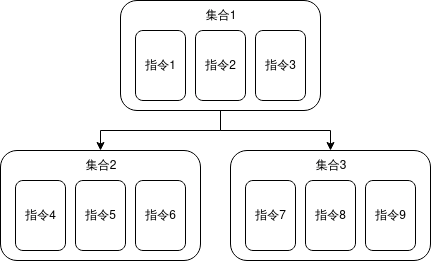

tt> 最后更新于2025年10月03日 | [历史记录](https://github.com/SmileYik/LuaInMinecraftBukkitII/commits/gh-page/docs/Command.md)

> 此页面内容对应于 LuaInMinecraftBukkit II 插件的**1.1.0**版本, 历史文档可以插件此页面的历史记录

在这个文档中, 将介绍怎么在 Lua 中注册 Bukkit 指令.

## Bukkit 指令构成

一般来讲, 在 Java 中处理 Bukkit 指令, 需要先去 `plugin.yml` 中注册一个指令, 然后在插件中实现 `onCommand` 方法, 去判断 `label` 以及 `args`, 最后根据判断情况去选择执行哪个指令方法.

具体情况类似于:

```java
private static final String COMMAND_LABEL = "MyCommand";
public boolean onCommand(CommandSender sender, 
                         Command command, 
                         String label, 
                         String[] args) {
    // 先匹配 label, 当然也可以匹配 command
    if (COMMAND_LABEL.equalsIgnoreCase(label)) {
        if (args.length == 0) {
            // ...
        } else if (args.length == 1) {
            if (Objects.equals(args[0], "sub1")) {
                // ...
            } else if (Objects.equals(args[0], "sub2")) {
                // ...
            }
        }
    }
}
```

现在在 Lua 中也可以使用类似的指令注册方法.

### 在 Lua 中注册原始的 Bukkit 指令

自 **1.1.0** 版本开始, 可以使用 `luaBukkit.env:registerRawCommand` 方法去注册一个原始的 Bukkit 指令.
这个方法接受2个形参, 第一个形参为指令名, 第二个形参为指令处理器(Lua闭包).

例如我们要注册一个 `/home` 指令, 我们可以这样注册:

```lua
luaBukkit.env:registerRawCommand("command", function (sender, command, label, args)
    -- handle your command
    return true
end)
```

对于指令处理器, 在指令触发时, 会传入4个参数, 分别为 `CommandSender sender`, `Command command`, `String label` 和 `String[] args`, 并且指令处理器需要拥有一个 `bool` 类型的返回值.可以看见这个指令控制器和上述 `Bukkit` 的 `onCommand` 指令签名相同.

直接使用 `luaBukkit.env:registerRawCommand` 注册指令是一个非常简单的方法, 但是如果我们的指令存在一大堆子指令, 这时候该如何避免一大堆子指令判断呢? 这时候可以使用插件内建的 `SimpleCommand` 库去简化指令判断流程.

## 简单的指令

LuaInMinecraftBukkit II 中使用了 `SimpleCommand` 来简化指令判断流程.

`SimpleCommand` 整体使用反射设计, 每一个指令都对应着一个实际的方法. 它将 `plugin.yml` 中注册的指令称为 **根指令**, 还将每一个指令都视为 **指令名+指令参数** 的形式, 此时在 Bukkit 调用 `/根指令 指令名 指令参数` 时它就会根据输入的指令名去寻找其对应的方法, 然后将执行指令的人还有指令参数作为参数传递给指令方法去执行. 简单的来说, `SimpleCommand` 简化了寻找指令这一流程, 使得指令编写者将注意力集中在指令实际内容上.

当然, 指令不可能恰好每个都符合 `/根指令 指令名 指令参数` 形式, 它必定是 `/根指令 指令名1 指令名2 指令名n 指令参数` 的形式, 就像下面图一样.


为了解决这个问题, `SimpleCommand` 将每一个指令都打包成一个集合, 并为其命名, 使得这一个集合中所有指令都是以 `/集合名 指令名 指令参数` 形式响应的. 然后为集合构建一个从属关系, 然后在寻找指令时, 先寻找指令是属于哪个集合的, 然后再去集合中寻找具体是哪个指令. 这样, 指令就变成了 `/集合名1 集合名2 集合名n 指令名 指令参数`. 此时, 只要确保集合**仅有一个根节点集合**, 并且这个**根节点集合的名字为根指令名字**, 就可以实现上述 `/根指令 指令名1 指令名2 指令名n 指令参数` 的指令形式



## 在 Lua 中注册指令

说了那么多, 这在 Lua 中注册指令的实际情况是什么样的呢? 其实只能说和 `SimpleCommand` 中的逻辑完全一致.

我们可以通过 `luaBukkit.env` 全局变量的 `commandClassBuilder()` 方法去构建一个指令集合, 在创建完想要的集合后使用 `luaBukkit.env` 中的 `registerCommand(根指令名, 集合数组(数组风格的 Lua Table))`. 而在创建集合的过程中, 就可以定义集合之间的从属关系了.

而执行指令时调用的 Lua 函数, 应该接收两个参数, 一个为执行指令者实例, 还有一个是指令参数(字符串数组). 具体函数形式如下所示:

```lua
function onCommand(sender, args) 
    -- do something.
end
```

这里有很多方法去构建指令和指令集合, 下面会一一介绍.

### 构建指令集合

#### 链式构造指令集合

这种风格的构建方式我个人还是比较优雅的, lua 代码如下所示:

```lua
local itemCommandClass = luaBukkit.env:commandClassBuilder()
    :command("get")         -- 指令名
        :args({"name"})     -- 指令参数数组 (数组风格的LuaTable)
        :desc("get a item") -- 指令描述
        :handler(           -- 指令处理器
            function(sender, args) 
                doSomething() 
            end
        )
    :command("store")
        :args({"name"})
        :description("store a item and named it")
        :handler(function(sender, args) doSomething() end)
    :build("item")  -- 将这一个指令集合命名为 "item"
```

#### 用 Lua Table 创建指令

还有一种较为简洁的方法:

```lua
local nbtCommandClass = luaBukkit.env:commandClassBuilder()
    :command({
        -- 指令名
        command = "read",
        -- 指令参数
        args = {"key"},
        -- 指令描述
        description = "read item's nbt key",
        -- 指令方法
        handler = function(sender, args) doSomething() end
    })
    :command({
        command = "write",
        args = {"key", "value"},
        description = "rite key-value to item' nbt",
        handler = function(sender, args) doSomething() end
    })
    -- 设定该指令集合名称为 `nbt`, 并将其至于 `item` 集合之下
    :build("nbt", "item")
```

### 注册指令集合

在以上两个例子中构造了两个指令集合, 存储在变量 `itemCommandClass` 与 `nbtCommandClass` 中. 现在是时候注册指令了. 

根据构造关系, `itemCommandClass` 指令是根节点, 所以它的集合名作为根指令名称进行注册, 所以有如下注册代码:

```lua
local result = luaBukkit.env:registerCommand(
    "item", 
    {itemCommandClass, nbtCommandClass}
)
if result:isError() then 
    luaBukkit.log:info("Register command failed!") 
end
```

这样就注册了四个指令: 

+ /item get [name]
+ /item store [name]
+ /item nbt read [key]
+ /item nbt write [key] [value]

之后在服务器终端输入指令 `/item help` 就能看见相关指令帮助:

```
item help
[21:19:52 INFO]: 
------------HELP-----------------
item get [name] - get a item
item nbt - 
item store [name] - store a item and named it
---------------------------------
item nbt help
[21:20:20 INFO]: 
------------HELP-----------------
item nbt read [key] - read item's nbt key
item nbt write [key] [value] - rite key-value to item' nbt
---------------------------------
```

## 面向 Lua 的 API

### CommandProperties

```java
/**
 * 与LuaTable关联, LuaTable中包含下述同名同类型字段, 将会直接转化为本实体中的字段.
 * <p>String[] 类型可以直接使用数组风格的LuaTable, 例如 <code>local array = {'a', 'b'}</code></p>
 * <p>
 *     ILuaCallable 类型为Lua中的function闭包, 并且这个闭包需要有两个形参,
 *     第一个形参为 <code>sender</code>, 代表谁执行的指令,
 *     第二个形参为 <code>args</code>, 代表指令参数.
 *     例如 <code>local callable = function(sender, args) end</code>
 * </p>
 *
 */
public class CommandProperties {
    /**
     * 指令名称, 必填
     */
    private String command = null;

    /**
     * 父指令名称, 可选, 用于标记一个指令类的父指令类型
     */
    private String parentCommand = null;

    /**
     * 指令别名, 可选, 构建顶级指令类以及注册指令时可能需要用到.
     */
    private String[] aliases = null;

    /**
     * 指令参数, 可选, 仅在添加指令方法时才会用到(也就是调用command方法时需要)
     */
    private String[] args = null;

    /**
     * 指令描述, 可选
     */
    private String description = null;

    /**
     * 指令权限, 可选
     */
    private String permission = null;

    /**
     * 是否只能由玩家执行指令, 可选
     */
    private boolean needPlayer = false;

    /**
     * 是否无限长度指令参数, 可选, 与args字段类似.
     */
    private boolean unlimitedArgs = false;

    /**
     * 指令处理器, 在添加指令方法时才会用到(也就是调用command方法时需要, 此时变为必填)
     * <p>
     *     ILuaCallable 类型为Lua中的function闭包, 并且这个闭包需要有两个形参,
     *     第一个形参为 <code>sender</code>, 代表谁执行的指令,
     *     第二个形参为 <code>args</code>, 代表指令参数.
     *     例如 <code>local callable = function(sender, args) end</code>
     * </p>
     */
    private ILuaCallable handler = null;
}
```

这个类型对应的 Lua Table 结构如下:

```lua
local command = {
    command = "",
    parentCommand = "",
    aliases = {},
    args = {},
    description = "",
    permission = "",
    needPlayer = false,
    unlimitedArgs = false,
    handler = function (sender, args) end
}
```

### ILuaCommandClassBuilder

```java
/**
 * 指令类建造器. 指令类是一个包含多条指令的集合, 并且指令类也有自己的名称.
 * <p>
 *     举个例子, 现有如下指令:
 *     <pre><code>
 *         /item get [name]
 *         /item store [name]
 *         /item nbt read [key]
 *         /item nbt write [key] [value]
 *     </code></pre>
 * </p>
 * <p>
 *     既然指令类是一个包含多条指令的集合, 而每一条实际指令方法之间又没有层级关系,
 *     只能匹配指令的固定词还有它的参数, 那么, 指令之间的层级关系就由指令类之间的层级关系生成.
 *     以上的四条指令可以抽取成两个指令类, 分别如下:
 *     <li>
 *         item 指令类: 包含指令 <code>get [name]</code>, <code>store [name]</code>.
 *     </li>
 *     <li>
 *         nbt 指令类: 包含指令 <code>read [key]</code>, <code>write [key] [value]</code>
 *     </li>
 * </p>
 * <p>
 *     为了让<code>item</code>指令类与<code>nbt</code>指令类之间有层级关系,我们可以在构建时,
 *     先构造<code>item</code>指令类, 直接使用<code>build(String)</code>方法,
 *     再构造<code>nbt</code>指令类, 使用<code>build(String, String)</code>方法.
 *     之后注册指令时, 就可以将两个指令类型一起注册. 而在 Lua 中的实际注册代码可以参考以下代码:
 *     <pre><code>
 *          -- 构造 item 指令类
 *          local itemCommandClass = luaBukkit.env:commandClassBuilder()
 *             :command("get")      -- get 指令
 *                 :args({"name"})
 *                 :description("get a item")
 *                 :handler(function(sender, args) doSomething() end)
 *             :command("store")    -- store 指令
 *                 :args({"name"})
 *                 :description("store a item and named it")
 *                 :handler(function(sender, args) doSomething() end)
 *             :build("item")
 *
 *          -- 构造 nbt 指令类
 *          local nbtCommandClass = luaBukkit.env:commandClassBuilder()
 *             :command("read")     -- read 指令
 *                 :args({"key"})
 *                 :description("read item's nbt key")
 *                 :handler(function(sender, args) doSomething() end)
 *             :command("write")    -- write 指令
 *                 :args({"key", "value"})
 *                 :description("write key-value to item' nbt")
 *                 :handler(function(sender, args) doSomething() end)
 *             :build("nbt", "item") -- 设定 nbt 类的父指令类为 item 类
 *
 *          -- 注册指令, 并且将最顶层, 也就是没有父指令类的指令类名称写到第一个形参中,
 *          -- 并且将两个指令类组成数组风格的Table, 传入第二个形参.
 *          local result = luaBukkit.env:registerCommand("item", {itemCommandClass, nbtCommandClass})
 *          if result:isError() then luaBukkit.log:info("Register command failed!") end
 *     </code></pre>
 * </p>
 *
 */
public interface ILuaCommandClassBuilder {
    /**
     * 设定指令别名, 当且仅当该指令为顶级指令时有效
     *
     * @param aliases 别名
     * @return 构造器
     */
    ILuaCommandClassBuilder aliases(String... aliases);

    /**
     * 设置该类中所有指令都需要玩家才能执行.
     *
     * @return 该构造器
     */
    ILuaCommandClassBuilder needPlayer();

    /**
     * 设置该指令描述
     *
     * @param description 描述
     * @return 构造器
     */
    ILuaCommandClassBuilder description(String description);

    /**
     * 设置该类下所有指令所需要的权限.
     *
     * @param permission 权限
     * @return 构造器
     */
    ILuaCommandClassBuilder permission(String permission);

    /**
     * 使用指令构造器新建一个指令. 对于它的其他方法重载来讲, 该方法可能更加优雅.
     *
     * @param commandName 指令名称
     * @return 指令构造器
     */
    ILuaCommandBuilder command(@NotNull String commandName);

    /**
     * 注册一个指令.
     * table格式详细请看<code>CommandProperties</code>类
     *
     * @param table table, table 必须包含 <code>command</code> 与 <code>handler</code> 字段
     * @return 构造器
     * @throws Exception 如果给予的table不符合规范时抛出.
     * @see CommandProperties
     */
    ILuaCommandClassBuilder command(@NotNull LuaTable table) throws Exception;

    /**
     * 添加若干数量指令
     *
     * @param tables lua table 数组
     * @return 此构造器
     * @throws Exception 如果给予的table不符合规范时抛出.
     * @see CommandProperties
     * @see LuaCommandClassBuilder#command(LuaTable)
     */
    ILuaCommandClassBuilder commands(@NotNull LuaTable... tables) throws Exception;

    /**
     * 添加一个指令.
     *
     * @param callable lua闭包
     * @param command  指令名称
     * @return 此构造器
     */
    ILuaCommandClassBuilder command(@NotNull ILuaCallable callable, @NotNull String command);

    /**
     * 添加一个指令.
     *
     * @param callable    lua闭包
     * @param command     指令名称
     * @param description 指令描述
     * @return 此构造器
     */
    ILuaCommandClassBuilder command(@NotNull ILuaCallable callable,
                                    @NotNull String command,
                                    @NotNull String description);

    /**
     * 添加一个指令.
     *
     * @param callable lua闭包
     * @param command  指令名称
     * @param args     指令参数
     * @return 此构造器
     */
    ILuaCommandClassBuilder command(@NotNull ILuaCallable callable, @NotNull String command, String[] args);

    /**
     * 添加一个指令.
     *
     * @param callable    lua闭包
     * @param command     指令名称
     * @param args        指令参数
     * @param description 指令描述
     * @return 此构造器
     */
    ILuaCommandClassBuilder command(@NotNull ILuaCallable callable, @NotNull String command, String[] args,
                                    String description);

    /**
     * 添加一个指令.
     *
     * @param callable    lua闭包
     * @param command     指令名称
     * @param args        指令参数
     * @param description 指令描述
     * @param permission  指令权限
     * @return 此构造器
     */
    ILuaCommandClassBuilder command(@NotNull ILuaCallable callable, @NotNull String command, String[] args,
                                    String description, String permission);

    /**
     * 添加一个指令.
     *
     * @param callable    lua闭包
     * @param command     指令名称
     * @param args        指令参数
     * @param description 指令描述
     * @param permission  指令权限
     * @param needPlayer  是否需要玩家执行
     * @return 此构造器
     */
    ILuaCommandClassBuilder command(@NotNull ILuaCallable callable, @NotNull String command, String[] args,
                                    String description, String permission, boolean needPlayer);

    /**
     * 添加一个指令.
     *
     * @param callable      lua闭包
     * @param command       指令名称
     * @param args          指令参数
     * @param description   指令描述
     * @param permission    指令权限
     * @param needPlayer    是否需要玩家执行
     * @param unlimitedArgs 是否无限参数长度
     * @return 此构造器
     */
    ILuaCommandClassBuilder command(@NotNull ILuaCallable callable,
                                    @NotNull String command,
                                    String[] args, String description, String permission,
                                    boolean needPlayer, boolean unlimitedArgs);

    /**
     * 构建指令类型.
     *
     * @param metaTable     lua table,
     *                      有效字段为 command(必填),
     *                      aliases, description, permission, needPlayer, parentCommand
     * @param commandTables 与commands方法类似.
     * @return 指令类型
     * @throws Exception 如果不符合要求时抛出, 例如缺少必填字段
     * @see CommandProperties
     * @see LuaCommandClassBuilder#command(LuaTable)
     */
    Class<?> build(LuaTable metaTable, LuaTable... commandTables) throws Exception;

    /**
     * 构建指令
     * @param command 根指令名
     * @return 构建好的指令类
     */
    Class<?> build(@NotNull String command);

    /**
     * 构建指令, 并将次类型归类在指定父级指令下. 例如有两个指令类,
     * <li>
     *     指令类1的顶级指令名为 <code>item</code>, 其中包含子指令: <code>get</code>, <code>set</code>
     * </li>
     * <li>
     *     指令类2的顶级指令名为 <code>nbt</code>, 其中包含子指令: <code>read</code>, <code>clear</code>.
     * </li>
     * 此时构建指令时, 将指令2的父级指令名设置为指令1, 注册完指令后, 实际生成的指令是这样的:
     * <pre><code>
     *      /item get
     *      /item set
     *      /item nbt read
     *      /item nbt clear
     * </code></pre>
     * @param command       顶级指令名
     * @param parentCommand 父级指令名
     * @return 构建好的指令类
     */
    Class<?> build(@NotNull String command, String parentCommand);
}
```

### ILuaCommandBuilder

```java
public interface ILuaCommandBuilder {
    /**
     * 指令所需要的参数, 这里的参数用于匹配指令长度, 并且给予执行指令人员提示.
     * 例如这个指令: <code>/myCommand kill [player_name]</code>, <code>kill</code>
     * 是指令名称, 而<code>player_name</code>是一个由执行者提供的参数.
     * 所以构建这个指令时, 需要使用这个方法去声明需要提供的参数.
     * 对于该例子来说, 可以这样实现:
     * <pre><code>
     *     luaBukkit.env:commandClassBuilder()
     *         :command("kill")
     *             :args({"player_name"})
     *             :handler(function (sender, args) doSomeThing() end)
     *         :build("myCommand")
     * </code></pre>
     *
     * @param args 指令参数
     * @return 构造器
     */
    ILuaCommandBuilder args(String... args);

    /**
     * 添加对该指令的简单描述.
     *
     * @param description 描述
     * @return 构造器
     */
    ILuaCommandBuilder desc(String description);

    /**
     * 添加对该指令的简单描述.
     *
     * @param description 描述
     * @return 构造器
     */
    ILuaCommandBuilder description(String description);

    /**
     * 添加使用该指令时的权限校验.
     *
     * @param permission 权限
     * @return 构造器
     */
    ILuaCommandBuilder permission(String permission);

    /**
     * 设定这个指令只能玩家执行.
     *
     * @return 构造器
     */
    ILuaCommandBuilder needPlayer();

    /**
     * 设定这个指令的参数为无限长度, 匹配这个指令时会无视args中的实际长度.
     * 这在设定一些含空格的参数时特别有效.
     *
     * @return 构造器
     */
    ILuaCommandBuilder unlimitedArgs();

    /**
     * 设置这个指令的处理器并完成该指令构造.
     *
     * @param callable lua闭包
     * @return 指令类构造器
     */
    ILuaCommandClassBuilder handler(ILuaCallable callable);
}
```
