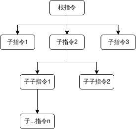
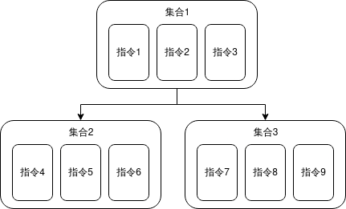

> Last updated on July 03, 2025 | [History](https://github.com/SmileYik/LuaInMinecraftBukkitII/commits/gh-page/docs/en/Command.md)

> This page corresponds to the latest version of the LuaInMinecraftBukkit II plugin. For historical documentation, you can find the history of this page.

> **!! The content of this file has machine translation !!** | [Origin](../Command.md)

## Bukkit Command

Generally, to process Bukkit commands in Java, 
you first need to register a command in `plugin.yml`, 
then implement the `onCommand` method in the plugin to determine `label` and `args`, 
and finally choose which command method to execute based on the determination.

It's like:

```java
private static final String COMMAND_LABEL = "MyCommand";
public boolean onCommand(CommandSender sender,
                         Command command,
                         String label,
                         String[] args) {
    if (COMMAND_LABEL.equalsIgnoreCase(label)) {
        if (args.length == 0) {
            // ...
        } else if (args.length == 1) {
            if (Objects.equals(args[0], "sub1")) {
                // ...
            } else if (Objects.equals(args[0], "sub2")) {
                // ...
            }
        }
    }
}
```

To avoid such a long series of if statements, Lua made some changes in the command registration process.

## Simple Command

LuaInMinecraftBukkit II uses `SimpleCommand` to simplify commands.

`SimpleCommand` uses a reflection design as a whole, and each command corresponds to an actual method. 
It calls the command registered in `plugin.yml` as the **root command**, and treats each command as **[command name] + [command parameters]**. 
When Bukkit calls `/[root command name] [command name] [parameters]`, 
it will find the corresponding method according to the input command name, 
and then pass the command executor and command parameters as arguments to the command method for execution.
 In short, `SimpleCommand` simplifies the process of finding commands, allowing command writers to focus on the actual content of the command.

Of course, it is impossible for every command to conform to the form of `/[root command] [command name] [command parameter]`; 
it must be in the form of `/[root command] [command name 1] [command name 2] [command name n] [command parameter]`, as shown in the figure below.



To solve this problem, `SimpleCommand` packages each command into a collection and names it, 
so that all commands in this collection respond in the form of `/[collection name] [command name] [command parameters]`. 
Then, a subordinate relationship is built for the collections. 
When searching for a command, it first looks for which collection the command belongs to,
 and then finds the specific command within that collection. 
 This way, the command becomes `/[collection name 1] [collection name 2] [collection name n] [command name] [command parameters]`. 
 At this point, as long as it is ensured that the collection has **only one root node collection**, 
 and the **name of this root node collection is the root command name**, 
 the above `/[root command] [command name 1] [command name 2] [command name n] [command parameters]` command form can be achieved.



## Registering Commands in Lua

After all that explanation, what does registering commands in Lua actually look like? In fact, it is exactly the same as the logic in `SimpleCommand`.

We can build a command collection using the `commandClassBuilder()` method of the `luaBukkit.env` global variable. 
After creating the desired collection, use `registerCommand(root command name, array of collections (array-style Lua Table))` from `luaBukkit.env`.
 During the process of creating the collection, you can define the subordinate relationships between collections.

The Lua function called when executing a command should accept two parameters: 
an instance of the command executor and an array of command parameters (string array). 
The specific function format is as follows:

```lua
function onCommand(sender, args)
    -- do something.
end
```

There are many ways to build commands and command collections, which will be introduced one by one below.

### Building Command Collections

#### Chained Construction of Command Collections

I personally find this style of construction quite elegant. The Lua code is as follows:

```lua
local itemCommandClass = luaBukkit.env:commandClassBuilder()
    :command("get")         -- Command name
        :args({"name"})     -- Command parameter array (array-style LuaTable)
        :desc("get a item") -- Command description
        :handler(           -- Command handler
            function(sender, args)
                doSomething()
            end
        )
    :command("store")
        :args({"name"})
        :description("store a item and named it")
        :handler(function(sender, args) doSomething() end)
    :build("item")  -- Name this command collection "item"
```

#### Creating Commands with Lua Table

There is also a more concise method:

```lua
local nbtCommandClass = luaBukkit.env:commandClassBuilder()
    :command({
        -- Command name
        command = "read",
        -- Command parameters
        args = {"key"},
        -- Command description
        description = "read item's nbt key",
        -- Command method
        handler = function(sender, args) doSomething() end
    })
    :command({
        command = "write",
        args = {"key", "value"},
        description = "write key-value to item' nbt",
        handler = function(sender, args) doSomething() end
    })
    -- Set the name of this command collection to `nbt` and place it under the `item` collection
    :build("nbt", "item")
```

### Registering Command Collections

In the above two examples, two command collections were constructed and stored in the variables `itemCommandClass` and `nbtCommandClass`. Now it's time to register the commands.

According to the construction relationship, `itemCommandClass` is the root node, so its collection name is registered as the root command name. The registration code is as follows:

```lua
local result = luaBukkit.env:registerCommand(
    "item",
    {itemCommandClass, nbtCommandClass}
)
if result:isError() then
    luaBukkit.log:info("Register command failed!")
end
```

This registers four commands:

  - /item get [name]
  - /item store [name]
  - /item nbt read [key]
  - /item nbt write [key] [value]

Afterward, entering `/item help` in the server console will show the relevant command help:

```
item help
[21:19:52 INFO]:
------------HELP-----------------
item get [name] - get a item
item nbt -
item store [name] - store a item and named it
---------------------------------
item nbt help
[21:20:20 INFO]:
------------HELP-----------------
item nbt read [key] - read item's nbt key
item nbt write [key] [value] - rite key-value to item' nbt
---------------------------------
```

## Lua-oriented API

### CommandProperties

```java
/**
 * Associated with LuaTable, the LuaTable contains fields with the same name and type as below, which will be directly converted into fields in this entity.
 * <p>String[] types can directly use array-style LuaTable, for example `local array = {'a', 'b'}`</p>
 * <p>
 * ILuaCallable type is a function closure in Lua, and this closure needs two formal parameters,
 * the first formal parameter is `sender`, representing who executed the command,
 * the second formal parameter is `args`, representing the command parameters.
 * For example `local callable = function(sender, args) end`
 * </p>
 *
 */
public class CommandProperties {
    /**
     * Command name, required
     */
    private String command = null;

    /**
     * Parent command name, optional, used to mark the parent command type of a command class
     */
    private String parentCommand = null;

    /**
     * Command alias, optional, may be used when building top-level command classes and registering commands.
     */
    private String[] aliases = null;

    /**
     * Command parameters, optional, only used when adding command methods (i.e., when calling the command method)
     */
    private String[] args = null;

    /**
     * Command description, optional
     */
    private String description = null;

    /**
     * Command permission, optional
     */
    private String permission = null;

    /**
     * Whether the command can only be executed by players, optional
     */
    private boolean needPlayer = false;

    /**
     * Whether it is an unlimited length command parameter, optional, similar to the args field.
     */
    private boolean unlimitedArgs = false;

    /**
     * Command handler, only used when adding command methods (i.e., when calling the command method, it becomes required at this point)
     * <p>
     * ILuaCallable type is a function closure in Lua, and this closure needs two formal parameters,
     * the first formal parameter is `sender`, representing who executed the command,
     * the second formal parameter is `args`, representing the command parameters.
     * For example `local callable = function(sender, args) end`
     * </p>
     */
    private ILuaCallable handler = null;
}
```

The corresponding Lua Table structure for this type is as follows:

```lua
local command = {
    command = "",
    parentCommand = "",
    aliases = {},
    args = {},
    description = "",
    permission = "",
    needPlayer = false,
    unlimitedArgs = false,
    handler = function (sender, args) end
}
```

### ILuaCommandClassBuilder

```java
/**
 * Command class builder. A command class is a collection containing multiple commands, and the command class also has its own name.
 * <p>
 * For example, there are the following commands:
 * <pre><code>
 * /item get [name]
 * /item store [name]
 * /item nbt read [key]
 * /item nbt write [key] [value]
 * </code></pre>
 * </p>
 * <p>
 * Since a command class is a collection containing multiple commands, and there is no hierarchical relationship between each actual command method,
 * only the fixed words of the command and its parameters can be matched, then the hierarchical relationship between commands is generated by the hierarchical relationship between command classes.
 * The above four commands can be extracted into two command classes, as follows:
 * <li>
 * item command class: contains commands `get [name]`, `store [name]`.
 * </li>
 * <li>
 * nbt command class: contains commands `read [key]`, `write [key] [value]`
 * </li>
 * </p>
 * <p>
 * To create a hierarchical relationship between the `item` command class and the `nbt` command class, we can construct the `item` command class first
 * by directly using the `build(String)` method, then construct the `nbt` command class using the `build(String, String)` method.
 * Afterward, when registering commands, both command types can be registered together. The actual registration code in Lua can refer to the following code:
 * <pre><code>
 * -- Construct item command class
 * local itemCommandClass = luaBukkit.env:commandClassBuilder()
 * :command("get")      -- get command
 * :args({"name"})
 * :description("get a item")
 * :handler(function(sender, args) doSomething() end)
 * :command("store")    -- store command
 * :args({"name"})
 * :description("store a item and named it")
 * :handler(function(sender, args) doSomething() end)
 * :build("item")
 *
 * -- Construct nbt command class
 * local nbtCommandClass = luaBukkit.env:commandClassBuilder()
 * :command("read")     -- read command
 * :args({"key"})
 * :description("read item's nbt key")
 * :handler(function(sender, args) doSomething() end)
 * :command("write")    -- write command
 * :args({"key", "value"})
 * :description("write key-value to item' nbt")
 * :handler(function(sender, args) doSomething() end)
 * :build("nbt", "item") -- Set nbt class's parent command class to item class
 *
 * -- Register commands, and write the name of the top-level command class (i.e., without a parent command class) in the first formal parameter,
 * -- and pass the two command classes as an array-style Table in the second formal parameter.
 * local result = luaBukkit.env:registerCommand("item", {itemCommandClass, nbtCommandClass})
 * if result:isError() then luaBukkit.log:info("Register command failed!") end
 * </code></pre>
 * </p>
 *
 */
public interface ILuaCommandClassBuilder {
    /**
     * Set command alias, only valid if this command is a top-level command
     *
     * @param aliases aliases
     * @return builder
     */
    ILuaCommandClassBuilder aliases(String... aliases);

    /**
     * Set all commands in this class to require a player to execute.
     *
     * @return this builder
     */
    ILuaCommandClassBuilder needPlayer();

    /**
     * Set this command description
     *
     * @param description description
     * @return builder
     */
    ILuaCommandClassBuilder description(String description);

    /**
     * Set the permission required for all commands under this class.
     *
     * @param permission permission
     * @return builder
     */
    ILuaCommandClassBuilder permission(String permission);

    /**
     * Create a new command using the command builder. For its other method overloads, this method may be more elegant.
     *
     * @param commandName command name
     * @return command builder
     */
    ILuaCommandBuilder command(@NotNull String commandName);

    /**
     * Register a command.
     * For detailed table format, please see `CommandProperties` class
     *
     * @param table table, table must contain `command` and `handler` fields
     * @return builder
     * @throws Exception Thrown if the given table does not conform to the specification.
     * @see CommandProperties
     * @see LuaCommandClassBuilder#command(LuaTable)
     */
    ILuaCommandClassBuilder command(@NotNull LuaTable table) throws Exception;

    /**
     * Add a certain number of commands
     *
     * @param tables lua table array
     * @return this builder
     * @throws Exception Thrown if the given table does not conform to the specification.
     * @see CommandProperties
     * @see LuaCommandClassBuilder#command(LuaTable)
     */
    ILuaCommandClassBuilder commands(@NotNull LuaTable... tables) throws Exception;

    /**
     * Add a command.
     *
     * @param callable lua closure
     * @param command  command name
     * @return this builder
     */
    ILuaCommandClassBuilder command(@NotNull ILuaCallable callable, @NotNull String command);

    /**
     * Add a command.
     *
     * @param callable    lua closure
     * @param command     command name
     * @param description command description
     * @return this builder
     */
    ILuaCommandClassBuilder command(@NotNull ILuaCallable callable,
                                    @NotNull String command,
                                    @NotNull String description);

    /**
     * Add a command.
     *
     * @param callable lua closure
     * @param command  command name
     * @param args     command parameters
     * @return this builder
     */
    ILuaCommandClassBuilder command(@NotNull ILuaCallable callable, @NotNull String command, String[] args);

    /**
     * Add a command.
     *
     * @param callable    lua closure
     * @param command     command name
     * @param args        command parameters
     * @param description command description
     * @return this builder
     */
    ILuaCommandClassBuilder command(@NotNull ILuaCallable callable, @NotNull String command, String[] args,
                                    String description);

    /**
     * Add a command.
     *
     * @param callable    lua closure
     * @param command     command name
     * @param args        command parameters
     * @param description command description
     * @param permission  command permission
     * @return this builder
     */
    ILuaCommandClassBuilder command(@NotNull ILuaCallable callable, @NotNull String command, String[] args,
                                    String description, String permission);

    /**
     * Add a command.
     *
     * @param callable    lua closure
     * @param command     command name
     * @param args        command parameters
     * @param description command description
     * @param permission  command permission
     * @param needPlayer  whether a player is required to execute
     * @return this builder
     */
    ILuaCommandClassBuilder command(@NotNull ILuaCallable callable, @NotNull String command, String[] args,
                                    String description, String permission, boolean needPlayer);

    /**
     * Add a command.
     *
     * @param callable      lua closure
     * @param command       command name
     * @param args          command parameters
     * @param description   command description
     * @param permission    command permission
     * @param needPlayer    whether a player is required to execute
     * @param unlimitedArgs whether unlimited parameter length
     * @return this builder
     */
    ILuaCommandClassBuilder command(@NotNull ILuaCallable callable,
                                    @NotNull String command,
                                    String[] args, String description, String permission,
                                    boolean needPlayer, boolean unlimitedArgs);

    /**
     * Build command type.
     *
     * @param metaTable     lua table,
     * valid fields are command (required),
     * aliases, description, permission, needPlayer, parentCommand
     * @param commandTables similar to commands method.
     * @return command type
     * @throws Exception Thrown if requirements are not met, e.g., missing required fields
     * @see CommandProperties
     * @see LuaCommandClassBuilder#command(LuaTable)
     */
    Class<?> build(LuaTable metaTable, LuaTable... commandTables) throws Exception;

    /**
     * Build command
     * @param command root command name
     * @return built command class
     */
    Class<?> build(@NotNull String command);

    /**
     * Build command and classify this type under the specified parent command. For example, there are two command classes,
     * <li>
     * Command class 1's top-level command name is `item`, which includes sub-commands: `get`, `set`
     * </li>
     * <li>
     * Command class 2's top-level command name is `nbt`, which includes sub-commands: `read`, `clear`.
     * </li>
     * When building commands, set the parent command name of command 2 to command 1. After registering commands, the actual generated commands will be like this:
     * <pre><code>
     * /item get
     * /item set
     * /item nbt read
     * /item nbt clear
     * </code></pre>
     * @param command       top-level command name
     * @param parentCommand parent command name
     * @return built command class
     */
    Class<?> build(@NotNull String command, String parentCommand);
}
```

### ILuaCommandBuilder

```java
public interface ILuaCommandBuilder {
    /**
     * The parameters required by the command. These parameters are used to match the command length and provide hints to the command executor.
     * For example, for this command: `/myCommand kill [player_name]`, `kill`
     * is the command name, and `player_name` is a parameter provided by the executor.
     * So when building this command, you need to use this method to declare the required parameters.
     * For this example, it can be implemented as follows:
     * <pre><code>
     * luaBukkit.env:commandClassBuilder()
     * :command("kill")
     * :args({"player_name"})
     * :handler(function (sender, args) doSomeThing() end)
     * :build("myCommand")
     * </code></pre>
     *
     * @param args command parameters
     * @return builder
     */
    ILuaCommandBuilder args(String... args);

    /**
     * Add a simple description for this command.
     *
     * @param description description
     * @return builder
     */
    ILuaCommandBuilder desc(String description);

    /**
     * Add a simple description for this command.
     *
     * @param description description
     * @return builder
     */
    ILuaCommandBuilder description(String description);

    /**
     * Add permission check when using this command.
     *
     * @param permission permission
     * @return builder
     */
    ILuaCommandBuilder permission(String permission);

    /**
     * Set this command to only be executable by players.
     *
     * @return builder
     */
    ILuaCommandBuilder needPlayer();

    /**
     * Set this command's parameters to be of unlimited length. When matching this command, the actual length in `args` will be ignored.
     * This is particularly effective when setting parameters that contain spaces.
     *
     * @return builder
     */
    ILuaCommandBuilder unlimitedArgs();

    /**
     * Set the handler for this command and complete the command construction.
     *
     * @param callable lua closure
     * @return command class builder
     */
    ILuaCommandClassBuilder handler(ILuaCallable callable);
}
```
