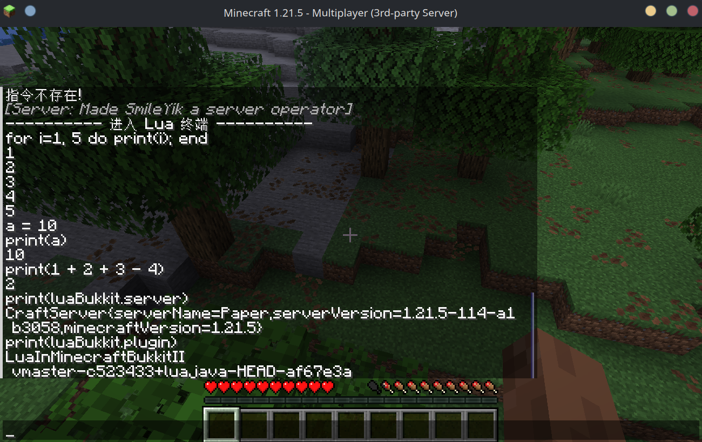

> Last updated on June 30, 2025 | [History](https://github.com/SmileYik/LuaInMinecraftBukkitII/commits/gh-page/docs/en/QuickStart.md)

> This page corresponds to the latest version of the LuaInMinecraftBukkit II plugin. For historical documentation, you can find the history of this page.

> **!! The content of this file has machine translation !!** | [Origin](../QuickStart.md)

In this document, I will teach you how to quickly use this plugin to create a Lua interpreter in the game, so that players in the game can execute commands, enter the Lua interpreter console, and execute Lua scripts through the chat box.

## First look at Lua

If you already have some understanding of Lua syntax, you can skip this section. This section is relatively rough and the content is very subjective. If you want to learn more, please look for a more detailed tutorial.

You can search the Internet for websites that run Lua online, or open a Lua interpreter on your system yourself.

### Comments in lua

In Lua, comments start with "--", for example, the following code will only execute `print`

```lua
-- I am comments
print("Hello")
```

### Data types in Lua

The data types in lua include the following:

+ NULL: nil
+ Number: 1, 1.5, -1, ...
+ Boolean: true, false
+ String: "Hello", 'world'
+ Table: {}, {1, 2, 3}, {a = 1, b = 2}
+ Function: function() end

#### Table

The table type can use the `.` operator to access the members or elements inside, or the `[]` operator to access the members or elements inside.

Tables can be divided into two types, one is an array-style table, which uses integers as key values, the key values ​​always start with 1, and are continuous from beginning to end. The other is a key-value pair table, similar to Map in Java/C++ and dictionary in Python. However, no matter which type of table, the elements in the table can be inconsistent or arbitrary.

For array-style tables, you can use `[idx]` to access the elements in it. idx is an integer, that is, its key value, and always starts with **1**!

```lua
-- String array style table,
strArray = {"a", "b", "c"}
-- numbers version
numArray = {1.5, 2.0, -1}
-- also array style, but include kinds of data types
objArray = {true, 1.5, "aaa", {"123"}, function (msg) print(msg); end}

print(strArray[1]) -- print a
print(numArray[2]) -- print 2.0
objArray[5]("hello") -- print hello
```

For non-array-style tables, you can use either `[]` to access the elements or `.` to access the elements.

```lua
func = function (msg) 
    print(msg)
end

t1 = {
    a = 1,
    b = true,
    c = func
}
print(t1["a"]) -- print 1
t1["a"] = 100  -- Reassign the value of "a"
print(t1.a)    -- print 100
t1.c("hello")  -- print hello

-- Add the key-value pair "func" and assign the value to "123". Note that it is the string "func"
t1.func = "123"
-- Add a new key-value pair, the key is the func function (not string 'func'), and the value is "456"
t1[func] = "456"

for key, value in pairs(t1) do
    print(key, value)
end
```

### Variables

Lua is divided into global variables and local variables, which can be declared or defined as follows:

```lua
-- global variables
num1 = 1
num2 = -1.5
table1 = {1, 2, 3}
-- local variables
local func = function() print("Hello") end
local bool1 = true
```

Global variables, as the name implies, are available throughout the entire script, as shown in the following example:

```lua
function func()
    a = 1    -- declare and define global variable a
    print(a) -- print the value of a, here is 1
end
print(a) -- The result is nil, because the variable a has not been declared or defined yet.
func()   -- Execute func function and print 1
print(a) -- The variable a = 1 is declared and defined in the func function, so the output is 1
```

Similarly, local variables represent variables used locally, that is, variables can only be used within a certain scope. The following example:

```lua
function func()
    local a = 1 -- declare and define global variable a
    print(a)    -- print the value of a, here is 1
end             -- After the method is executed, the local variable a is cleared
print(a) -- The result is nil, because the variable a has not been declared or defined yet.
func()   -- Execute func function and print 1
print(a) -- the output is nil
```

### Operation

Similar to other languages, the following is an example:

#### Arithmetic operations

```lua
a = 1
b = 2.5
c = a + b       --  3.5
d = a - b       -- -1.5
e = (a + b) * b --  8.75
f = a + b * b   --  7.25

str1 = "Hello"
str2 = 'World'
-- You cannot use the + sign to concatenate strings, you must use ..
str3 = str1 .. ', ' .. str2  -- Hello, World
```

#### Logical operations

Here is how to perform AND or NOT operations in Lua.

```lua
a = true
b = false
c = a == b  -- Is a equal to b? Result: false
d = a or b  -- if one of a and b is true, it is true. Result: true
e = a and b -- if both a and b are true, it is true. Result: false
f = a ~= b  -- if a is not equal to b, result: true
g = not a   -- negate, true becomes false, and vice versa, result: false

a = 1
h = a > 1       -- if a is greater than 1: false
i = a >= 1      -- if a is greater than or equal to 1: true
j = a < 10      -- if a is less than 10: true
k = a <= 0.1    -- if a is less than or equal to 0.1: false
l = a == 1      -- if a is equal to 1: true
m = a ~= 1      -- if a is not equal to 1: false
```

### Process Control

#### Branch Decision

If xxx is true, then xxx; otherwise xxx.
That is, if statement. In Lua, if statement looks like:

```lua
-- if 
if condition then
    -- do something...
end

-- if-else
if condition then
    -- true
else 
    -- false
end

-- if-else-if
if condition1 then
    -- do something ...
elseif condition2 then
    -- do something ...
else 
    -- do something
end
```

For example, use if-else to determine whether a number is a three-digit number, a two-digit number, or a single-digit number.

```lua
num = 96
if num < 1000 and num >= 100 then
    print("3")
elseif num >= 10 and num < 100 then
    print("2")
elseif num >= 0 and num < 10 then
    print("1")
else
    print("more than 3")
end
```

#### Loop

Similar to other languages, Lua also has `while` loops and `for` loops, and also has a `break` statement to break the loop.
However, Lua **does not** have a `continue` statement to skip the current loop.

##### While Loop

The syntax of the while loop is as follows:

```lua
while condition 
do
    -- do something.
end

-- add 1 to 10
a = 1
sum = 0
while a <= 10 do 
    sum = sum + a
    a = a + 1
end
print(sum)
```

##### For Loop

There are two types of for loops, one is a numerical for loop.

```lua
-- from, to, step are all integers
-- from is the starting value, to is the ending value, step is the step length, the step length can be left blank, the default value is 1
for var=from, to, step do
    -- do something
end

-- print 1, 2, ..., 10(include)
for a = 1, 10 do
    print(a)
end

-- print 10, 9, ..., 1(include)
for a = 10, 1, -1 do
    print(a)
end
```

Another type of for loop is an iterator.

```lua
for key, value in pairs(table) do
    -- do something
end

-- Traverse array-style tables
t1 = {1, 2, 3}
for i, v in pairs(t1) do
    print(i, v)
end

-- Traverse tables
t2 = {a = 1, b = 2}
for k, v in pairs(t2) do
    print(k, v)
end
```

## Preparation

Now it's time to prepare the environment. First, you need to install the plugin. Simply put the plugin into the plugins folder. After that, the plugin will take care of all the troublesome dynamic link libraries!

After running the server once, a new directory named LuaInMinecraftBukkitII will be created under the plugins directory. It contains a configuration file named config.json and other directories. They look like this.

```
❯ tree .
.
├── config.json   plugin configuration file
├── debug.log     debug log
├── luaLibrary    lua libraries
├── luaState      lua environment folder
├── natives       native libraries
└── scripts       lua scripts files
```

The default configuration file of the plugin prepares a lua environment named `default` for you, and when initializing the environment, it automatically loads the `test.lua` file in the `luaState` directory. We can just use the `test.lua` file for practice!

Of course, you can also set it yourself, the following is a sample config.json.

```json
{
  // project resource url
  "projectUrl": "https://raw.githubusercontent.com/SmileYik/LuaInMinecraftBukkitII/refs/heads/gh-page",
  // lua version
  "luaVersion": "luajit",
  // Always check that the dependency hash is correct
  "alwaysCheckHashes": false,
  // enable debug
  "debug": true,
  // lua environment setting
  "luaState": {
    // lua environment id
    "default": {
      // The directory in which the environment is running, "/" represents the luaState directory under the plugin directory.
      "rootDir": "/",
      // Whether to ignore access restrictions. When ignoring access restrictions, you can force access to non-public methods in Java.
      "ignoreAccessLimit": false,
      // Initialize the script list, fill in the script file name below, and the script file must be found in rootDir.
      "initialization": [
        // loaded file
        {
          // lua script file name, here is test.lua
          "file": "test.lua",
          // Whether to reload automatically, currently useless
          "autoReload": false,
          // Bukkit plugins depends
          "depends": []
        }
      ]
    }
  }
}
```

Suppose you want to add a lua script to be automatically executed when the environment is initialized, you can add the file you want to add under `initialization`. For this project, add a `chat-console.lua`. Keep the default value in `rootDir`, and edit the lua script in `plugins/LuaInMiencraftBukkitII/luaState/chat-console.lua`!

```json
      "initialization": [
        // loaded file
        {
          // lua script file name, here is test.lua
          "file": "test.lua",
          // Whether to reload automatically, currently useless
          "autoReload": false,
          // Bukkit plugins depends
          "depends": []
        },
        {
          // lua script file name
          "file": "chat-console.lua",
          "autoReload": false,
          "depends": []
        }
      ]
```

## Java with Lua

Although the purpose of this plugin is to allow Lua scripts to interact with Bukkit servers, in essence, it is also about allowing Lua scripts to interact with Java. However, this part cannot be verified using an online Lua interpreter, and can only be run on the bukkit server!

### Warm Up

In the above environment preparation, we added a `chat-console.lua` file. We open this file and make a simple edit:

```lua
-- /plugins/LuaInMiencraftBukkitII/luaState/chat-console.lua
luaBukkit.log:info("Hello, Lua!")
```

after finished, save the file, and execute command in your bukkit server console: `lua reloadEnv default`,
after reloaded lua environment, You will see `Hello, Lua!` output in the console:

```
[19:32:58 INFO]: [LuaInMinecraftBukkitII] Hello, Lua!
[19:32:58 INFO]: Reloaded Lua Environment
```

### Java variable types and Lua variable types

To review, Java has several basic types: `boolean`, `byte`, `short`,`int`, `long`, `float`, `double`, `char`; in addition to the basic types, there are strings `String`, custom types based on `Object`; in addition, there are arrays of basic types and arrays of custom types. Lua contains Boolean type, number type, string type, table, method and a user data type (actually understood as a C pointer, skipped here).

When Lua interacts with Java, data type conversion is mostly unnoticeable.,

|Lua types|Java types|
|:-:|:-:|
| Number | `byte`, `short`, `int`, `long`, `float`, `double`, `Byte`, `Short`, `Integer`, `Long`, `Float`, `Double`|
| Boolean | `boolean`, `Boolean` |
| String | `String` |
| Userdata | 其他自定义类型 |
| One-dimensional array style table | `LuaArray` |
| Table | `LuaTable` |
| Function | `ILuaCallable`, `LuaFunction` |

#### Converting between arrays

All arrays in Java will be converted to array-style tables in Lua.
And array-style tables in Lua will try to be converted to one-dimensional arrays in Java.

For example, when `{1, 2, 3, 4}` in Lua is passed to Java, it will try to convert it into `int[]`; `{"abc", "def"}` will try to convert it into `String[]`; and {`{1, 2, 3}, {4, 5, 6}`} will try to convert it into `Object[]`

### Calling Java Methods

During the warm-up process, we called the `info` method in `luaBukkit.log`.
`luaBukkit.log` is an instance of the `java.util.logging.Logger` type in Java. The `info` method receives a string, so there is a usage method like `luaBukkit.log:info("Hello, Lua!")` in the warm-up.
The `:` operator is almost a necessary operator for calling Java methods. Using `.` will fail the call!

`luaBukkit.server` is an instance of the `CraftServer` type of Bukkit in Java. You can try using `luaBukkit.log:info(luaBukkit.server)`. After reloading the Lua environment, an error is reported. The error content is:

```
[19:36:37 WARN]: [LuaInMinecraftBukkitII] Failed to eval lua file 'chat-console.lua', because: [C Side Exception] Invalid method call. No such method.
	at [LuaVM] [0] [C] method: info (=[C]:-1)
	at [LuaVM] [1] [main] : (unknown name) (@plugins/LuaInMinecraftBukkitII/luaState/chat-console.lua:2)
```

The error above tells us that `luaBukkit.log` does not have an `info` method. This is because `info` only accepts string types as parameters. It cannot process the `luaBukkit.server` (an instance of the `CraftServer` type), so this error is reported. So when a similar error is reported, you can carefully check whether your parameters are passed incorrectly!

### Get Java instance attributes

Java has static attributes and common attributes, but due to some permission issues, the Lua environment closes the non-public attribute acquisition by default, which can be open in the configuration file.

Getting Java instance attributes is the same as getting fields in the Lua table, using the `.` operator to get. For example

```lua
luaBukkit.log:info(luaBukkit.server.BROADCAST_CHANNEL_USERS)
```

In fact, the above statement prints the value of the `Server.BROADCAST_CHANNEL_USERS` constant, which is `bukkit.broadcast.user`.

## Writing a Lua terminal based on a chat box

Finally, let's get down to business. Now let's write a Lua terminal based on the chat box! In the environment preparation, we created a file `/plugins/LuaInMiencraftBukkitII/luaState/chat-console.lua`. Open this file and start writing.

### Register Commands

Write two commands to control whether a player enters terminal mode. The two commands are:

+ `/luaconsole open`: Opens the terminal for the player who executed the command.
+ `/luaconsole close`: Closes the terminal for the player who executed the command.

```lua
-- /plugins/LuaInMiencraftBukkitII/luaState/chat-console.lua
-- Players entering terminal mode
local players = {}

-- define commands
local commands = {
    {
        -- command name
        command = "open",
        -- command description
        description = "Enter Lua Terminal",
        -- command parameters, since there are no parameters, we leave it empty.
        args = {},
        --command permission, only op or has permission player can use this command
        permission = "LuaConsole.Admin",
        -- We want it to be run by players only. Where is the chatbox in the console!
        needPlayer = true,
        -- The method executed when the command is triggered
        handler = function (sender, args)
            -- Since it can only be run by a player, the sender must be of Player type
            -- Directly mark the player name as true, indicating that the terminal mode has been entered
            players[sender:getName()] = true
            sender:sendMessage("---------- Enter Lua Terminal ----------")
        end
    },
    {
        command = "close",
        description = "Quit Lua Terminal",
        args = {},
        permission = "LuaConsole.Admin",
        needPlayer = true,
        handler = function (sender, args)
            -- delete player name
            players[sender:getName()] = nil
            sender:sendMessage("---------- Quit Lua Terminal ----------")
        end
    }
}

local topCommandClass = luaBukkit.env:commandClassBuilder()  -- Get the command type builder and start construct a command class
    :commands(commands)   -- Pass in the command information we want to register
    :build("luaconsole")  -- set name is luaconsole

-- Register the command as 'luaconsole', which should be consistent with the command type name constructed above.
local result = luaBukkit.env:registerCommand("luaconsole", { topCommandClass })
if result:isError() then
    luaBukkit.log:info("Register Command Failed!")
else
    luaBukkit.log:info("Register Command Successfully!")
end
```

Now use the command `/lua reloadEnv default` to reload the `chat-console.lua` script. If nothing goes wrong, you should be able to see the words `Register Command Successfully!`. Then enter the command in the console and you will get a prompt.

```
[21:07:19 INFO]: [LuaInMinecraftBukkitII] Register Command Successfully!
luaconsole help
[21:07:28 INFO]: 
------------HELP-----------------
luaconsole open - Enter Lua Terminal
luaconsole close - Quit Lua Terminal
---------------------------------
luaconsole open
[21:09:39 INFO]: 只能玩家执行这个指令!
```

**If the player executes the command, remember to give the player permission!**

### Register Event Listener

It's not enough to have commands. We need to monitor the messages sent by players in the chat box. Is there a way to do this? Indeed, Bukkit provides a player chat event, and we need to monitor this event!

This event is called [`AsyncPlayerChatEvent`](https://hub.spigotmc.org/javadocs/spigot/org/bukkit/event/player/AsyncPlayerChatEvent.html), and in Java, its full class name is `org.bukkit.event.player.AsyncPlayerChatEvent`. Let's listen for this event now!

You can register for events using the following methods:

``` lua
-- ... register command part ...

-- onPlayerChat is a function type variable,
-- This function accepts one parameter, which is used to receive the event instance.
local onPlayerChat = function (event)
    -- todo logical
end

-- Get the listener constructor
-- Name your listener "MyPlayerChatListener"
luaBukkit.env:listenerBuilder()
    -- Subscribe to an event
    :subscribe({
        -- Subscribe to the AsyncPlayerChatEvent event
        event = "org.bukkit.event.player.AsyncPlayerChatEvent",
        -- When an event occurs, it is handled by onPlayerChat.
        handler = onPlayerChat
    })
    :build()
    :register("MyPlayerChatListener")
```

OK, now we can perfect our own event handling logic. We need to filter the players and filter out the players who are no longer in the list:

```lua
-- onPlayerChat is a function type variable,
-- This function accepts one parameter, which is used to receive the event instance.
local onPlayerChat = function (event)
    -- Get the player that triggered the event from the event
    local player = event:getPlayer()
    -- Check if the player is in the list, if not, return directly
    if not players[player:getName()] then
        return
    end
end
```

OK, now we are going to get the information sent by the player and parse it into Lua!
Parsing text values ​​and running them as Lua requires the use of the `loadstring` function (before Lua5.4) or the `load` function (Lua 5.4). For convenience, we can rename it to `loadstring`

```lua
-- This is to adapt to the changes in Lua5.4.
-- This is done to take care of users using different Lua versions.
-- Before Lua5.4, loadstring was used to execute lua scripts
-- After Lua5.4, it was renamed to load
if loadstring == nil then
    loadstring = load
end

-- onPlayerChat is a function type variable,
-- This function accepts one parameter, which is used to receive the event instance.
local onPlayerChat = function (event)
    -- .....
end
```

Next, we will improve our `onPlayerChat` method! Since the messages sent are parsed into lua code, we should not send messages anymore, so we need to cancel the event and then execute the lua code.

```lua
-- onPlayerChat is a function type variable,
-- This function accepts one parameter, which is used to receive the event instance.
local onPlayerChat = function (event)
    -- Get the player that triggered the event from the event
    local player = event:getPlayer()
    -- Check if the player is in the list, if not, return directly
    if not players[player:getName()] then
        return
    end

    -- cancel event
    event:setCancelled(true)
    -- Get the information sent by the player and send it to the player separately
    local msg = event:getMessage()
    player:sendMessage(msg)
    -- Load and execute lua script
    -- Return execution success or failure and reason for failure
    local result, error = pcall(loadstring(msg))
    -- If the execution is not successful, the execution failure will be output to the player.
    if not result then
        player:sendMessage("Failure: " .. error)
    end
end
```

Finally, the complete code for registering events looks like this:

```lua
-- ... previous codes ...

-- This is to adapt to the changes in Lua5.4.
-- This is done to take care of users using different Lua versions.
-- Before Lua5.4, loadstring was used to execute lua scripts
-- After Lua5.4, it was renamed to load
if loadstring == nil then
    loadstring = load
end

-- onPlayerChat is a function type variable,
-- This function accepts one parameter, which is used to receive the event instance.
local onPlayerChat = function (event)
    -- Get the player that triggered the event from the event
    local player = event:getPlayer()
    -- Check if the player is in the list, if not, return directly
    if not players[player:getName()] then
        return
    end

    -- cancel event
    event:setCancelled(true)
    -- Get the information sent by the player and send it to the player separately
    local msg = event:getMessage()
    player:sendMessage(msg)
    -- Load and execute lua script
    -- Return execution success or failure and reason for failure
    local result, error = pcall(loadstring(msg))
    -- If the execution is not successful, the execution failure will be output to the player.
    if not result then
        player:sendMessage("Failure: " .. error)
    end
end

-- Get the listener constructor
-- Name your listener "MyPlayerChatListener"
luaBukkit.env:listenerBuilder()
    -- Subscribe to an event
    :subscribe({
        -- Subscribe to the AsyncPlayerChatEvent event
        event = "org.bukkit.event.player.AsyncPlayerChatEvent",
        -- When an event occurs, it is handled by onPlayerChat.
        handler = onPlayerChat
    })
    :build()
    :register("MyPlayerChatListener")
```

Now after reloading the lua environment, enter the game, enter `/luaconsole open` to enter the terminal mode, and then send `a = 1` and `print(a)`, and you will find that nothing happens. The value of a is not output in the chat box or the console. What's going on? This is because the `print` method is actually executed on the C language side, and `io.stdout:flush()` needs to be executed separately to flush the output value out of the buffer. This is too troublesome, so we rewrite the `print` method to let it display all the values ​​in the chat box.

In order to make the `print` method visible to the local variable `player`, we can override the `print` method in `onPlayerChat`.

```lua
    -- Get the information sent by the player and send it to the player separately
    local msg = event:getMessage()
    player:sendMessage(msg)

    -- Rewrite the print method. In this function body, the player variable is visible.
    print = function (msg)
        -- Userdata is usually a Java object, which can be directly concatenated with an empty string to form a string.
        -- Other types must be converted to strings first
        if type(msg) ~= "userdata" then
            msg = tostring(msg)
        end
        player:sendMessage(msg .. "")
    end

    -- If the execution is not successful, the execution failure will be output to the player.
    local result, error = pcall(loadstring(msg))
```

### Final code

Finally finished, the final code looks like this!

```lua
-- /plugins/LuaInMiencraftBukkitII/luaState/chat-console.lua
-- Players entering terminal mode
local players = {}

-- define commands
local commands = {
    {
        -- command name
        command = "open",
        -- command description
        description = "Enter Lua Terminal",
        -- command parameters, since there are no parameters, we leave it empty.
        args = {},
        --command permission, only op or has permission player can use this command
        permission = "LuaConsole.Admin",
        -- We want it to be run by players only. Where is the chatbox in the console!
        needPlayer = true,
        -- The method executed when the command is triggered
        handler = function (sender, args)
            -- Since it can only be run by a player, the sender must be of Player type
            -- Directly mark the player name as true, indicating that the terminal mode has been entered
            players[sender:getName()] = true
            sender:sendMessage("---------- Enter Lua Terminal ----------")
        end
    },
    {
        command = "close",
        description = "Quit Lua Terminal",
        args = {},
        permission = "LuaConsole.Admin",
        needPlayer = true,
        handler = function (sender, args)
            -- delete player name
            players[sender:getName()] = nil
            sender:sendMessage("---------- Quit Lua Terminal ----------")
        end
    }
}

local topCommandClass = luaBukkit.env:commandClassBuilder()  -- Get the command type builder and start construct a command class
    :commands(commands)   -- Pass in the command information we want to register
    :build("luaconsole")  -- set name is luaconsole

-- Register the command as 'luaconsole', which should be consistent with the command type name constructed above.
local result = luaBukkit.env:registerCommand("luaconsole", { topCommandClass })
if result:isError() then
    luaBukkit.log:info("Register Command Failed!")
else
    luaBukkit.log:info("Register Command Successfully!")
end

-- This is to adapt to the changes in Lua5.4.
-- This is done to take care of users using different Lua versions.
-- Before Lua5.4, loadstring was used to execute lua scripts
-- After Lua5.4, it was renamed to load
if loadstring == nil then
    loadstring = load
end

-- onPlayerChat is a function type variable,
-- This function accepts one parameter, which is used to receive the event instance.
local onPlayerChat = function (event)
    -- Get the player that triggered the event from the event
    local player = event:getPlayer()
    -- Check if the player is in the list, if not, return directly
    if not players[player:getName()] then
        return
    end

    -- cancel event
    event:setCancelled(true)
    -- Get the information sent by the player and send it to the player separately
    local msg = event:getMessage()
    player:sendMessage(msg)

    -- Rewrite the print method. In this function body, the player variable is visible.
    print = function (msg)
        -- Userdata is usually a Java object, which can be directly concatenated with an empty string to form a string.
        -- Other types must be converted to strings first
        if type(msg) ~= "userdata" then
            msg = tostring(msg)
        end
        player:sendMessage(msg .. "")
    end

    -- Load and execute lua script
    -- Return execution success or failure and reason for failure
    local result, error = pcall(loadstring(msg))
    -- If the execution is not successful, the execution failure will be output to the player.
    if not result then
        player:sendMessage("Failure: " .. error)
    end
end

-- Get the listener constructor
-- Name your listener "MyPlayerChatListener"
luaBukkit.env:listenerBuilder()
    -- Subscribe to an event
    :subscribe({
        -- Subscribe to the AsyncPlayerChatEvent event
        event = "org.bukkit.event.player.AsyncPlayerChatEvent",
        -- When an event occurs, it is handled by onPlayerChat.
        handler = onPlayerChat
    })
    :build()
    :register("MyPlayerChatListener")
```

Then reload the lua environment, and after entering the server, you can run the lua terminal directly.


