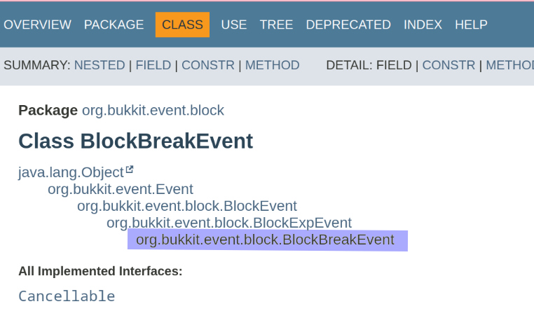
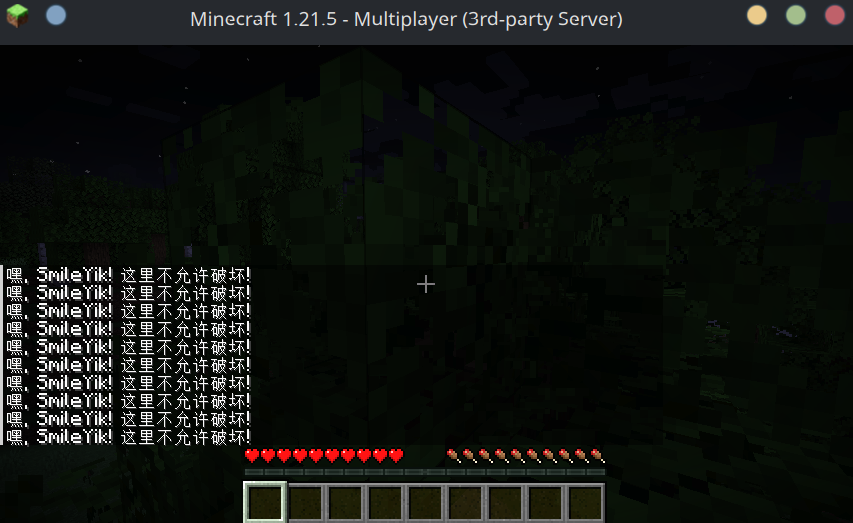

> 最后更新于2025年06月30日 | [历史记录](https://github.com/SmileYik/LuaInMinecraftBukkitII/commits/gh-page/docs/zh/EventListener.md)

> 此页面内容对应于 LuaInMinecraftBukkit II 插件的最新版本, 历史文档可以插件此页面的历史记录

在这个文档中, 将介绍怎么在 Lua 中注册 Bukkit 事件监听器.

## 准备

在开始前, 假设你已经对 Bukkit 的事件有一定的了解, [Bukkit Javadoc](https://hub.spigotmc.org/javadocs/spigot/org/bukkit/event/package-summary.html) 能够帮助你了解 Bukkit 中有哪些事件, 之后我们也用得到这个文档.

## 监听 Bukkit 事件所需参数

在向 Bukkit 注册事件监听器时, 需要四种参数, 分别如下所示:

+ 事件类型: 必要
+ 事件处理器: 必要
+ [监听优先级](https://hub.spigotmc.org/javadocs/spigot/org/bukkit/event/EventPriority.html): 默认为 NORMAL, 可选值有`HIGH`, `HIGHEST`, `NORMAL`, `LOW`, `LOWEST`, `MONITOR`
+ 忽略已经取消的事件: 默认为 `false`

### 事件类型

事件类型为一个字符串, 是 Java 中类的全类名.

例如 [BlockBreakEvent](https://hub.spigotmc.org/javadocs/spigot/org/bukkit/event/block/BlockBreakEvent.html)(方块破坏事件), 全类名可以在它的Javadoc中的标题下找到:



如上图紫色标记的文本就是 `BlockBreakEvent` 事件的全类名: `org.bukkit.event.block.BlockBreakEvent`

### 事件处理器

事件处理器在 Lua 中是一个函数. 它接收事件类型实例作为形参, 一般来讲, 这个函数形如:

```lua
-- event 为监听的事件实例.
function onEvent(event)
    -- 处理事件
end
```

## 在 Lua 中订阅事件

在订阅事件前, 得先获得事件监听器构建器, 可以通过全局变量 `luaBukkit.env` 中的 `listenerBuilder()` 方法获得.

通过事件监听器构建器中包含多种方式监听事件, 下面一一列举.

```lua
luaBukkit.env:listenerBuilder()
    -- 方式1: 基本订阅事件
    :subscribe("事件全类名", 
    function(event)
        -- do something.
    end)
    -- 方式2: 自定义订阅的优先级
    :subscribe("事件全类名", "事件优先级",
    function(event)
        -- do something.
    end)
    -- 方式3: 自定义是否忽略已经取消的事件
    :subscribe("事件全类名", true/false,
    function(event)
        -- do something.
    end)
    -- 方式4: 或者两者都有
    :subscribe("事件全类名", "事件优先级", true/false,
    function(event)
        -- do something.
    end)
    -- 方式5: 使用 Table 传参
    :subscribe({
        event = "事件全类名",
        priority = "事件优先级",
        ignoreCancelled = true/false,
        handler = function(event)
            -- do something.
        end
    })
    -- 方式6: 使用 Table 订阅多个事件
    :subscribes({
        {
            event = "事件全类名1",
            handler = function(event)
                -- do something.
            end
        },
        {
            event = "事件全类名2",
            ignoreCancelled = true,
            handler = function(event)
                -- do something.
            end
        },
        {
            event = "事件全类名3",
            priority = "事件优先级",
            handler = function(event)
                -- do something.
            end
        }
    })
    :build()
    :register("自己的订阅名")
```

## 实现禁止玩家破坏方块

现在知道 [BlockBreakEvent](https://hub.spigotmc.org/javadocs/spigot/org/bukkit/event/block/BlockBreakEvent.html)(方块破坏事件)的全类名, 还可以通过它的 Javadoc 文档知道它所包含的方法, 现在我们来实现如何禁止玩家破坏方块把.

```lua
-- 声明一个名为 onBreakBlock 变量, 并赋值一个函数.
-- 这个变量现在就可以作为我们的事件处理器了.
local onBreakBlock = function (event)
    --  为了实现禁止玩家破坏方块功能, 只需要取消这个事件就好了.
    event:setCancelled(true)

    -- 同时还得提示一下玩家发生了什么, 为什么破坏不了.
    local player = event:getPlayer()
    player:sendMessage("嘿, " .. player:getName() .. "! 这里不允许破坏!")
end

-- 好了, 是时候订阅事件并注册了.
luaBukkit.env:listenerBuilder()
    :subscribe({
        event = "org.bukkit.event.block.BlockBreakEvent",
        handler = onBreakBlock
    })
    :build()
    :register("NoBreak")
```

好了, 现在就可以保存文件, 然后重载 lua 环境就能在游戏中看见效果了.



## 面向 Lua 的 API

### LuaEventListenerProperty

`LuaEventListenerProperty` 在使用 Lua Table 传参时会使用到,
传入的 Lua Table 会**自动的**转换为 `LuaEventListenerProperty` 实例.

```java
/**
 * 事件监听JavaBean类型.
 */
public class LuaEventListenerProperty {
    /**
     * 事件类型全类名, 必填.
     */
    private String event;
    /**
     * 事件优先级, 选填, 默认为<code>NORMAL</code>, 可用值为
     * <code>LOWEST</code>, <code>LOW</code>, <code>NORMAL</code>,
     * <code>HIGH</code>, <code>HIGHEST</code>, <code>MONITOR</code>.
     * 并且大小写不敏感.
     */
    private String priority;
    /**
     * 是否忽略已经取消的事件. 选填, 默认为false
     */
    private boolean ignoreCancelled = false;
    /**
     * 事件处理器, 必填. 该字段为一个Lua闭包, 并且闭包应该拥有一个形参,
     * 用于接收事件实例.
     */
    private ILuaCallable handler;
}
```

这个类型对应的 Lua Table 结构如下:

```lua
local eventListener = {
    event = "",
    priority = "",
    ignoreCancelled = true,
    handler = function(event) end
}
```

其中 `handler` 与 `event` 是必填的.

### ILuaEventListenerBuilder

这个就是事件监听器构建器, 以下它的方法定义:

```java
public interface ILuaEventListenerBuilder {
    /**
     * 订阅一个事件
     *
     * @param eventClassName 事件全类名, 常见类名可以忽略包路径
     * @param closure        事件闭包, 固定一个形参, 为监听的事件实例.
     * @return 此构建器
     * @throws ClassNotFoundException 如果该事件类型不存在则抛出.
     */
    ILuaEventListenerBuilder subscribe(@NotNull String eventClassName,
                                       @NotNull ILuaCallable closure) throws ClassNotFoundException;

    /**
     * 订阅一个事件
     *
     * @param eventClassName 事件全类名, 常见类名可以忽略包路径
     * @param eventPriority  事件优先级
     * @param closure        事件闭包, 固定一个形参, 为监听的事件实例.
     * @return 此构建器
     * @throws ClassNotFoundException 如果该事件类型不存在则抛出.
     */
    ILuaEventListenerBuilder subscribe(@NotNull String eventClassName,
                                       @NotNull EventPriority eventPriority,
                                       @NotNull ILuaCallable closure) throws ClassNotFoundException;

    /**
     * 订阅一个事件
     *
     * @param eventClassName 事件全类名, 常见类名可以忽略包路径
     * @param eventPriority  事件优先级, 包含<code>LOWEST</code> <code>LOW</code> <code>NORMAL</code>
     *                       <code>HIGH</code> <code>HIGHEST</code> <code>MONITOR</code>
     * @param closure        事件闭包, 固定一个形参, 为监听的事件实例.
     * @return 此构建器
     * @throws ClassNotFoundException 如果该事件类型不存在则抛出.
     */
    ILuaEventListenerBuilder subscribe(@NotNull String eventClassName,
                                       @NotNull String eventPriority,
                                       @NotNull ILuaCallable closure) throws ClassNotFoundException;

    /**
     * 订阅一个事件
     *
     * @param eventClassName  事件全类名, 常见类名可以忽略包路径
     * @param eventPriority   事件优先级
     * @param ignoreCancelled 是否忽略已取消的事件.
     * @param closure         事件闭包, 固定一个形参, 为监听的事件实例.
     * @return 此构建器
     * @throws ClassNotFoundException 如果该事件类型不存在则抛出.
     */
    ILuaEventListenerBuilder subscribe(@NotNull String eventClassName,
                                       @NotNull EventPriority eventPriority,
                                       boolean ignoreCancelled,
                                       @NotNull ILuaCallable closure) throws ClassNotFoundException;

    /**
     * 订阅一个事件
     *
     * @param eventClassName  事件全类名, 常见类名可以忽略包路径
     * @param eventPriority   事件优先级, 包含<code>LOWEST</code> <code>LOW</code> <code>NORMAL</code>
     *                        <code>HIGH</code> <code>HIGHEST</code> <code>MONITOR</code>
     * @param ignoreCancelled 是否忽略已取消的事件.
     * @param closure         事件闭包, 固定一个形参, 为监听的事件实例.
     * @return 此构建器
     * @throws ClassNotFoundException 如果该事件类型不存在则抛出.
     */
    ILuaEventListenerBuilder subscribe(@NotNull String eventClassName,
                                       @NotNull String eventPriority,
                                       boolean ignoreCancelled,
                                       @NotNull ILuaCallable closure) throws ClassNotFoundException;

    /**
     * 订阅一个事件
     *
     * @param eventClassName  事件全类名, 常见类名可以忽略包路径
     * @param ignoreCancelled 是否忽略已取消的事件.
     * @param closure         事件闭包, 固定一个形参, 为监听的事件实例.
     * @return 此构建器
     * @throws ClassNotFoundException 如果该事件类型不存在则抛出.
     */
    ILuaEventListenerBuilder subscribe(@NotNull String eventClassName,
                                       boolean ignoreCancelled,
                                       @NotNull ILuaCallable closure) throws ClassNotFoundException;

    /**
     * 订阅一个事件, 传入LuaTable类型, 并且必须包含<code>event</code>和<code>handler</code>字段.
     * <code>event</code>字段为文本类型, 是要订阅的事件的全类名.
     * <code>handler</code>字段为Lua闭包, 并且包含一个形参.
     *
     * @param table LuaTable
     * @return 此构建器
     * @throws Exception 如果LuaTable不符合要求则抛出
     */
    ILuaEventListenerBuilder subscribe(@NotNull LuaTable table) throws Exception;

    /**
     * 与<code>subscribe(LuaTable)</code>类似, 但是是接受一个LuaTable数组(数组风格LuaTable),
     * 以批量订阅事件.
     *
     * @param tables table组成的数组, 形似与<code>local tables = {nil, {}, {}, {}, nil}</code>
     * @return 此构建器
     * @throws Exception 如果LuaTable不符合要求则抛出
     */
    ILuaEventListenerBuilder subscribes(@NotNull LuaTable... tables) throws Exception;

    /**
     * 构造未监听的事件实例.
     *
     * @return 未监听的事件实例
     * @throws NoSuchMethodException
     * @throws InvocationTargetException
     * @throws InstantiationException
     * @throws IllegalAccessException
     */
    LuaUnregisteredListener build()
            throws NoSuchMethodException,
            InvocationTargetException,
            InstantiationException,
            IllegalAccessException;
}
```

### LuaUnregisteredListener

这个是构造器构造出来的产物, 正如其名, 他还没有被注册, 所以这个类型提供了一个注册方法.

```java
/**
 * 未监听的事件类型.
 */
public class LuaUnregisteredListener {
    /**
     * 注册Bukkit事件, 需要提供事件监听器名, 并且需要确保在同一个LuaState环境中,
     * 所有注册的事件的事件监听器名都必须唯一(没有重复的事件监听器名). 并且后续可以通过
     * 事件监听器名去取消监听已注册的事件.
     * @param eventName 事件监听器名.
     */
    public void register(String eventName);
}

```
